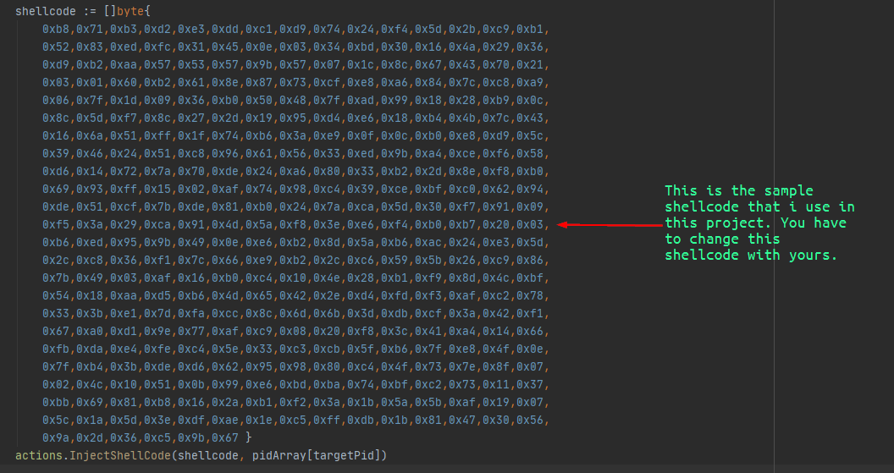

# GOback
GOback is a backdoor written in GO that use shellcode injection technique for achiving its task.

## What is Backdoor?
A backdoor is a typically covert method of bypassing normal authentication or encryption in a computer, product, embedded device (e.g. a home router), or its embodiment (e.g. part of a cryptosystem, algorithm, chipset, or even a "homunculus computer" —a tiny computer-within-a-computer such as that found in Intel's AMT technology).[1][2] Backdoors are most often used for securing remote access to a computer, or obtaining access to plaintext in cryptographic systems. From there it may be used to gain access to privileged information like passwords, corrupt or delete data on hard drives, or transfer information within autoschediastic networks.

A backdoor may take the form of a hidden part of a program,[3] a separate program (e.g. Back Orifice may subvert the system through a rootkit), code in the firmware of the hardware,[4] or parts of an operating system such as Windows.[5][6][7] Trojan horses can be used to create vulnerabilities in a device. A Trojan horse may appear to be an entirely legitimate program, but when executed, it triggers an activity that may install a backdoor.[8] Although some are secretly installed, other backdoors are deliberate and widely known. These kinds of backdoors have "legitimate" uses such as providing the manufacturer with a way to restore user passwords

## Features

- Golang with Win32 API Calls
- Registery editing for persistence
- Copy itself to different location with name heIp.exe
- Low detection rate (7/71) in virustotal
- 32 bit process searching in infected machine
- Shellcode injection

## Installing

- go get -u github.com/TheTitanrain/w32
- go build -ldflags="-H windowsgui" -o main.exe main.go

## Shellcode

You have to edit shellcode section with your depends in main.go that is showed in the below picture.

## Author
* **Hakan İlbiz**

## License

This project is licensed under the GNU GPL v3.0 License - see the [LICENSE](./LICENSE) file for details

